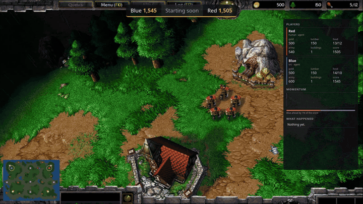

# agentenv-game-env

[](LICENSE)
[](https://github.com/scaleapi/agentenv-framework)



*A Warcraft III match between two scripted players, broadcast by this package's `start_broadcast` (4× speed, then
the end card at normal speed). The game env is [agentenv-wc3-plugin](https://github.com/earakely-scale/agentenv-wc3-plugin):
its spectator view is the game's own picture, and the overlay adds the score bug, the game's sidebar as a page widget
and the end card, read from the lobby and the match alone.*

Game envs for [AgentEnv](https://github.com/scaleapi/agentenv-framework). A game has players and a course of play, and
this package gives every game env one way to say who plays it and how it is going:

- **A lobby**, `urn:game:lobby/v1`, that the env serves. It holds the next game's player slots, which are filled one
  player at a time before the game is created. A player is an agent, a person, or the game's own AI.
- **An env card for each player slot** that an agent or a person plays: the env as that player sees it, with the
  interfaces it plays through.
- **A match**, `urn:game:match/v1`, that the lobby's close creates: the game from its start gate to its end, with its
  progress and each player's outcome and scores.
- **`AgentEnvGameEnv`**, the base class that serves them and tells each request which player slot it plays. A game
  declares its settings as pydantic models and marks its own parts of the lobby and the match with decorators.
- **A spectator view and match files**: the env as an onlooker sees it, the game alone on screen; and the files the
  game keeps of a finished match (its replay, its recording), which the match's `files` method lists.
- **A license**, `urn:game:license/v1`, for a game that needs something from its user to run (license files, keys,
  terms to accept), which must never be in its image, a task file or a reply.
- **A broadcast** of a match to Twitch or X, or only recorded: the game's spectator view under an overlay of the
  players, the clock and the score. It reads only the lobby and the match, so it is the same for every game.
- **Nine task steps**: `add_license` gives a game its license from agent-env's secret store; `open_lobby`,
  `add_player_slot` and `close_lobby` open, fill and close the lobby of any game env built on it; `finish_match`
  and `cancel_match` end its match, and `save_match_files` keeps its files; `start_broadcast` and `save_broadcast`
  broadcast it and keep the video.

The same task steps then put players in any game: one agent against the game's AI, two models against each other, a
person beside an agent.

**Two examples to read:**
- **[Warcraft III](https://github.com/earakely-scale/agentenv-wc3-plugin)**, a real game built on this package. Its
  lobby takes a match's settings (map, seed, time limit, stepping or realtime), and its player slots take a faction, a
  team, a label and, for the game's AI, a level. Its tasks broadcast matches like the one above and keep each match's
  native replay, videos and timeline as its match files.
- **[Tic-tac-toe](examples/tictactoe.py)**, about 170 lines in this repo: every part of the package in one small game.
  [Try it](#try-it-tic-tac-toe) walks through it.

A Warcraft III task with two agents and the game's AI runs as this DAG:

```
deploy_env
 ├─ open_lobby (the game's settings)
 │   ├─ add_player_slot "2": the game's AI, orc, team 2
 │   ├─ add_player_slot "0": agent p1, human, team 1      (also after deploy_agent p1)
 │   └─ add_player_slot "1": agent p2, undead, team 1     (also after deploy_agent p2)
 ├─ deploy_agent p1, p2
 └─ close_lobby, after every add_player_slot: the game and its match are created
     └─ prompt_agent p1, p2 ── finish_match: the match played out to its end ── grade
```

**Contents:** [Install](#install) · [Try it: tic-tac-toe](#try-it-tic-tac-toe) ·
[Writing a game env](#writing-a-game-env) · [The lobby protocol](#the-lobby-protocol-urngamelobbyv1) ·
[The match protocol](#the-match-protocol-urngamematchv1) · [The task steps](#the-task-steps) ·
[Broadcasting a match](#broadcasting-a-match) · [Licenses](#licenses-urngamelicensev1) ·
[Development](#development) · [Not done yet](#not-done-yet)

## Install

It is not on PyPI yet; install it from GitHub. It needs Python 3.11 or newer.

```bash
pip install "agentenv-game-env @ git+https://github.com/earakely-scale/agentenv-game-env"
```

- **The env side** (`AgentEnvGameEnv`, the lobby, the match, the license, the routing) needs only
  `agentenv-framework-protocol`, `mcp` and `pydantic`. In an env image, install the package with `--no-deps` beside
  them.
- **The task steps** run in agent-env and need `agentenv-framework` too. Installed beside it, the package registers
  them through agent-env's `agent_env.task_steps` entry points: `agent-env plugin list` shows `9 task steps`.
- **The broadcast** also needs Docker on the machine that runs agent-env.

## Try it: tic-tac-toe

[`examples/tictactoe.py`](examples/tictactoe.py) is a complete game env in about 170 lines. It has two players, `x`
and `o`, each an agent or the game's AI. A player slot's id is its mark. Its game parts:

```python
from agentenv_game import AgentEnvGameEnv, Counter, GameError, MatchFile, MatchReport, MatchStatus, PlayerKind
from agentenv_game import PlayerSlotLimits, check_player_slot, create_game, match_files, match_report
from agentenv_game import player_slot_limits, spectator_card
from agentenv_protocol import environment_card, tool
from agentenv_protocol.types import EnvironmentCard, EnvironmentInterface


@environment_card(name="tictactoe")
class TicTacToe(AgentEnvGameEnv):
    class GameSettings(BaseModel):    # the lobby's settings: checked, defaults filled in, schema in the card
        model_config = ConfigDict(extra="forbid", use_attribute_docstrings=True)
        first: Literal["x", "o"] = "x"
        """Who moves first."""

    @player_slot_limits               # two players, each an agent or the game's AI
    def two_players(self, game_settings, requested):
        ...                           # refuse a request for more
        return PlayerSlotLimits(min=2, max=2, player_kinds=[PlayerKind.AGENT, PlayerKind.AI])

    @check_player_slot                # the player slots are "x" and "o"
    def a_mark(self, slot, lobby):
        if slot.player_id not in ("x", "o"):
            raise GameError("bad_slot", ...)

    @create_game                      # the lobby closed: set up the board, and let the AI move if it goes first
    async def new_game(self, lobby):
        self.players = {s.player_id: s for s in lobby.player_slots}
        self.board, self.turn = [" "] * 9, lobby.game_settings["first"]
        ...

    @match_report                     # how the match is going: read whenever the match is, kept once it's over
    def report(self):
        over = self.winner is not None
        return MatchReport(
            status="finished" if over else "started",
            status_detail=(f"{self.winner} won" if self.winner in ("x", "o") else "a draw") if over else None,
            progress=[Counter(name="game", unit="moves", value=9 - self.board.count(" "), limit=9)],
            outcomes={...} if over else {})                    # "x": "won", "o": "lost"

    @spectator_card                   # the board alone, for onlookers and a broadcast
    def spectators(self):
        return EnvironmentCard(name="tictactoe/spectators",
                               additionalInterfaces=[EnvironmentInterface(url="/spectate", transport="http")], ...)

    @match_files                      # what a finished match keeps: its moves
    async def kept(self, kinds):
        ...
        return [MatchFile(name=f"tictactoe-{self.lobby.lobby_id}.json", kind="moves",
                          content_type="application/json", file=path)]

    @tool()
    async def mark(self, cell: int):
        """Put your mark in a free cell on your turn: 0 to 8, top left to bottom right."""
        mine = self.player().player_id     # the player slot this request plays
        if self.match.status is MatchStatus.STARTED and ...:
            ...
```

The spectator page, `/spectate`, and the `/board.json` it reads are routes the example adds in its own
`create_app()`.

### Run it, and fill its lobby

```bash
python examples/tictactoe.py      # serves on port 18765; MCP_PORT sets another
```

```bash
L=http://127.0.0.1:18765/agentenv/ext/lobby
curl -s -XPOST $L/open -d '{"game_settings": {"first": "x"}}'
```
```json
{"lobby_id":"lb-cb04d0b9","status":"open","game_settings":{"first":"x"},
 "player_slot_limits":{"min":2,"max":2,"player_kinds":["agent","ai"]},"player_slots":[],"player_teams":[]}
```

An agent's player slot comes back with its environment. A second `x` is refused:

```bash
curl -s -XPOST $L/fill -d '{"player_id": "x", "player_kind": "agent", "player_name": "alice"}'
curl -s -XPOST $L/fill -d '{"player_id": "x", "player_kind": "agent", "player_name": "bob"}'
curl -s -XPOST $L/fill -d '{"player_id": "o", "player_kind": "ai"}'
curl -s -XPOST $L/close
```
```json
{"player_id":"x","player_kind":"agent","player_name":"alice","game_settings":{},"environment_url":"/players/x","headers":{}}
{"ok":false,"error":{"code":"slot_taken","message":"player slot 'x' is taken"}}               (HTTP 400)
{"player_id":"o","player_kind":"ai","game_settings":{},"headers":{}}
{"lobby_id":"lb-cb04d0b9","status":"closed", ..., "player_slots":[...],
 "player_teams":[{"team_id":"x","player_ids":["x"]},{"team_id":"o","player_ids":["o"]}]}
```

Alice's player slot serves its own env card at its `environment_url`:

```bash
curl -s http://127.0.0.1:18765/players/x/.well-known/agent-env.json
```
```json
{"name":"tictactoe/x","protocolVersion":"1.0","url":"/agentenv","preferredTransport":"JSONRPC",
 "additionalInterfaces":[{"url":"/mcp","transport":"mcp"}],"capabilities":{"operations":[]}}
```

### Play it

Alice's MCP client connects to the MCP interface of her player slot's card, `/players/x/mcp`. Every tool call there
plays her slot:

```
> show_board                         > mark {"cell": 4}
You are x.                           o |   |
  |   |                                | x |
  |   |                                |   |
  |   |                              x to play.
x to play.
```

The game's AI answered at once, in the top left. At `/players/carol/mcp` the tools refuse, because no player slot
`carol` is played in this game. At the env's own `/mcp` they refuse too, because a request there plays no one.

### Follow its match

The match was created when the lobby closed. Tic-tac-toe has nothing to line up before the first move, so it started at
once. Before the close, `GET` answers `null`:

```bash
M=http://127.0.0.1:18765/agentenv/ext/match
curl -s $M          # after the close
curl -s $M          # after alice plays 4, 2 and 6, and wins
```
```json
{"lobby_id":"lb-cb04d0b9","status":"started","progress":[{"name":"game","unit":"moves","value":0,"limit":9}],
 "player_states":{"x":{"status":"undecided"},"o":{"status":"undecided"}},"spectator_url":"/spectators"}
{"lobby_id":"lb-cb04d0b9","status":"finished","status_detail":"x won",
 "progress":[{"name":"game","unit":"moves","value":5,"limit":9}],
 "player_states":{"x":{"status":"won"},"o":{"status":"lost"}},"spectator_url":"/spectators"}
```

A finished match never changes, and a mark refuses: `Not marked: the match is finished.` Its files are listed now, and
each is served at its `path` until the next lobby opens:

```bash
curl -s -XPOST $M/files -d '{}'
```
```json
{"files":[{"name":"tictactoe-lb-cb04d0b9.json","kind":"moves","content_type":"application/json","bytes":156,
  "path":"/agentenv/ext/match/files/tictactoe-lb-cb04d0b9.json"}],"notes":[]}
```

From the close on, an onlooker watches the board at `http://127.0.0.1:18765/spectators/spectate`: the `http`
interface of the spectator view's card, at the match's `spectator_url`. That page is what a broadcast frames.

In a second game, alice stops after one mark and the harness finishes the match. Tic-tac-toe can't be played on
without its players, so it ends `cancelled`:

```bash
curl -s -XPOST $M/finish -d '{"lobby_id": "lb-ba0bc889"}'
```
```json
{"lobby_id":"lb-ba0bc889","status":"cancelled","status_detail":"tictactoe can't be played out without its players",
 "progress":[{"name":"game","unit":"moves","value":2,"limit":9}],
 "player_states":{"x":{"status":"undecided"},"o":{"status":"undecided"}},"spectator_url":"/spectators"}
```

### In an AgentEnv task

Register the example as an MCP server env, as with any env (its image runs `python tictactoe.py`). A task then puts an
agent against the game's AI:

```json
[
  {"id": "deploy", "type": "deploy_env", "env_id": "tictactoe"},
  {"id": "agent", "type": "deploy_agent", "agent_name": "alice", "a2a_agent_id": "your-agent", "env_ids": []},
  {"id": "lobby", "type": "open_lobby", "env_id": "tictactoe", "game_settings": {"first": "o"},
   "depends_on": ["deploy"]},
  {"id": "slot-x", "type": "add_player_slot", "env_id": "tictactoe", "depends_on": ["lobby", "agent"],
   "player_id": "x", "player_kind": "agent", "player_name": "alice"},
  {"id": "slot-o", "type": "add_player_slot", "env_id": "tictactoe", "depends_on": ["lobby"],
   "player_id": "o", "player_kind": "ai"},
  {"id": "close", "type": "close_lobby", "env_id": "tictactoe", "depends_on": ["slot-x", "slot-o"]},
  {"id": "play", "type": "prompt_agent", "agent_name": "alice", "depends_on": ["close"],
   "prompt": "You play tic-tac-toe through the tools. Win."},
  {"id": "finish", "type": "finish_match", "env_id": "tictactoe", "depends_on": ["play"]}
]
```

- **The agent deploys with `"env_ids": []`.** `add_player_slot` gives it its player slot's MCP address, so it plays
  `x`, not the env's own address.
- **A second agent in place of the AI** makes it model against model: deploy `bob` and give him player slot `"o"`.
- **`finish_match` leaves the final match** in the run's `metadata["game_match"]`, for a grader to read.
- **`save_match_files` after `finish_match`** keeps the moves as a file artifact, and
  [`start_broadcast`](#broadcasting-a-match) after `close_lobby` streams the match.

## Writing a game env

Subclass `AgentEnvGameEnv`, give it a card with agentenv-protocol's `@environment_card(name=...)` and its tools with
`@tool()`, as any AgentEnv environment.

### Settings

Declare the game's settings as pydantic models:

| Attribute | Checks | Its schema goes in |
|---|---|---|
| `GameSettings` | the lobby's `game_settings`, at open | the card's `open` request |
| `PlayerSlotSettings` | each player slot's `game_settings`, at fill | the card's `fill` request |

A nested class, as in the example, or an existing model assigned (`GameSettings = MySettings`). Without one, the game
takes no settings there. `ConfigDict(extra="forbid", use_attribute_docstrings=True)` refuses unknown keys and puts each
field's docstring in the published schema. A rule about one model's fields, such as a map that exists, is a pydantic
validator on it.

### The game's parts

Mark them with decorators, the way agentenv-protocol's data plane marks `@reset_data`:

| Decorator | Called | Takes (after `self`) | Returns | Without it |
|---|---|---|---|---|
| `@create_game`, async | when the lobby closes | `lobby` | nothing; a failure fails the lobby | required |
| `@player_slot_limits` | when a lobby opens | `game_settings` (its `GameSettings`), `requested` (the opener's `PlayerSlotLimits`) | the `PlayerSlotLimits` the lobby keeps | the lobby keeps the request |
| `@check_player_slot` | before the lobby takes a player slot | `slot`, `lobby` | nothing; raise to refuse | only the lobby's checks and the settings models |
| `@player_slot_card` | for an agent's or a person's player slot | `slot` | its `EnvironmentCard` | one MCP interface |
| `@player_teams` | as player slots fill | `lobby` | its `PlayerTeam`s, every player slot on exactly one | a team per player slot |
| `@match_report` | on every read of the match, until it's final | nothing | a `MatchReport` | the match has only its lifecycle |
| `@begin_game`, async | once, as the match starts | nothing | nothing; a failure fails the match | the match starts as the lobby closes |
| `@play_out`, async | by `finish` | nothing | nothing, once the game's rules or its limit have ended the match; it takes no player moves | `finish` cancels the match |
| `@spectator_card` | for the spectator view, once the lobby has closed | nothing | its `EnvironmentCard`, whose `http` interface is a page that shows the game alone | no spectator view, so no broadcast |
| `@match_files`, async | by `files`, once the match is final | `kinds`: the kinds asked for, or `None` for the defaults | `MatchFile`s, or a `MatchFiles` with `notes`; raise `ValueError` for kinds it doesn't keep | no files, and a note saying so |
| `@license_needs` | for the license's status, and as the lobby closes | nothing | the `LicenseItem`s the game still lacks; empty when licensed | no license; comes with `@install_license` |
| `@install_license` | when parts arrive | `parts`: a `LicenseParts` | nothing; raise `ValueError` to refuse a part | comes with `@license_needs` |

- **One method per decorator, across the class and its bases.** The method name is yours.
- **A `ValueError` from `@player_slot_limits` or `@check_player_slot` is the caller's `bad_settings`,** with your
  message. Raise a `GameError(code, message)` to give another code: `bad_slot` for a `player_id` the game doesn't have.
- **The marks are checked before the env serves:** one per decorator, `@create_game` present, `@license_needs` and
  `@install_license` together, and each method async or plain with the right number of arguments. A mistake fails at
  `create_app()` or the first lobby call, not mid-game.

### The match report

The match splits in two. The base class keeps what the protocol promises: the start gate, `cancelled`, and a final
match never changing. The game reports what only it knows in its `@match_report`, read whenever the match is:

| `MatchReport` field | |
|---|---|
| `status` | the game's own: `started`, `paused`, `finished` or `failed`. `failed` counts at any time, the others once the match has started. |
| `status_detail` | its words for it |
| `progress` | its `Counter`s |
| `outcomes` | `won`, `lost` or `drawn`, by `player_id`, for the players its rules have decided |
| `scores` | `Score`s, by `player_id` |

### In the game's tools and routes

- **`self.player()`** is the player slot the current request plays, by its `/players/<player_id>` address. It's
  `None` at the env's own address, and a request for an id that plays no agent or human slot is refused.
- **`self.match`** is how the match stands; check `self.match.status` before taking a move.
- **`await self.player_ready(player_id)`** on a player's first move, in a game with `@begin_game`.
- **`await self.begin_match(status_detail)`** starts the match without a silent player: the game's own stall rule.
- **`self.spectating()`** says the request came through the spectator view, under `/spectators`. The view's pages and
  their requests are the game's own routes, so one page can serve players and spectators and show each what is theirs.

**In process,** as tests or a game's own default setup use it, `self.lobby`, `self.new_lobby(...)`,
`self.fill_slot(SlotRequest(...))`, `await self.close_lobby()`, `self.cancel_lobby()`, `self.slot_card(player_id)`,
`await self.finish_match()`, `self.cancel_match()`, `await self.list_match_files(kinds)`, `self.license_status()` and
`self.add_license(files, keys, accept)` do what the methods do.

### Serving

`serve()` runs the env on `MCP_PORT` (default `18765`), as for any AgentEnv environment; `create_app()` builds its app
without serving it.

- **`create_app()` adds the routes** of the lobby, the match and the license, and the player slots' and the spectator
  view's addresses. Each protocol has several methods and the SDK serves one handler per extension, so the three are
  declared on the game's card and served by these routes.
- **A game adds routes of its own,** such as a spectator page, by overriding `create_app()` and calling
  `super().create_app()` first, as the example does.
- **Under an ASGI server of your own,** serve `create_app().streamable_http_app()`, which includes the
  `/players/...` and `/spectators/...` addresses.
- **`mount()` onto an app of your own isn't supported.**

## The lobby protocol: `urn:game:lobby/v1`

### Lifecycle

```
              open                   close                        the match (urn:game:match/v1)
 not_opened ───────► open ──────────────────────────► closed ───► not_started → started → ...
                      │  fill ×N      ├─ cancel ─────► cancelled   (no game)
                      │               └─ the game can't be created ─► failed   (no game; close answers 500)
                      └─ open again: a new lobby, dropping this one and its game
```

- **`open`** starts a new, empty lobby with these settings and a new `lobby_id`, dropping the last lobby and its game.
- **`fill`** adds one player while the lobby is open.
- **`close`** creates the game and its match from the filled player slots. After that the lobby is read-only, and
  the match takes over: [The match protocol](#the-match-protocol-urngamematchv1).
- **`cancel`** abandons an open lobby, for a run that ends before its game starts.
- **`closed`, `cancelled` and `failed` are final for that lobby.** Only a new `open` changes them. A game that can't be
  created from the slots fails the lobby: a retry opens a new one and fills it again.

Before any `open`, the lobby is `not_opened`, with the game's default settings. A game can use that to offer its own
default game to a client that never opens one.

### Methods

They're advertised on the env's card, in the `urn:game:lobby/v1` extension's `params.methods`, and called with
agentenv-protocol's `client.invoke_extension(base, card, LOBBY, params, method=...)`. Each method's `request` is a
JSON Schema, and `open`'s and `fill`'s include the game's own settings models, so a client can see what a game takes.

| Method | Route | Request | Response |
|---|---|---|---|
| `open` | `POST /agentenv/ext/lobby/open` | `{"game_settings": {...}, "player_slot_limits": {...}}`, both optional | the lobby |
| `get` | `GET /agentenv/ext/lobby` | | the lobby |
| `fill` | `POST /agentenv/ext/lobby/fill` | `{"player_id": ..., "player_kind": ..., "player_name": ..., "game_settings": {...}, "lobby_id": ...}`; `player_name`, `game_settings` and `lobby_id` optional | the filled player slot |
| `close` | `POST /agentenv/ext/lobby/close` | `{"lobby_id": ...}`, optional | the lobby |
| `cancel` | `POST /agentenv/ext/lobby/cancel` | `{"lobby_id": ...}`, optional | the lobby |

**A `lobby_id` guards against a lobby opened since.** `fill`, `close` and `cancel` refuse a `lobby_id` that isn't the
current lobby's (`lobby_replaced`). The task steps always send the one `open_lobby` opened.

### Types

| Type | Fields |
|---|---|
| `Lobby` | `lobby_id`: new on each open. `status`: `LobbyStatus`, `not_opened`, `open`, `closed`, `cancelled` or `failed`. `game_settings`: the game's own (a map, a seed, a time limit), checked against its `GameSettings`, every default filled in. `player_slot_limits`: a `PlayerSlotLimits`. `player_slots`: the filled `PlayerSlot`s, in the order they were filled, which means nothing. `player_teams`: the `PlayerTeam`s. |
| `PlayerSlotLimits` | `min`: at close, at least this many player slots filled. `max`: no more than this many. `player_kinds`: the kinds of player the game takes, `["agent"]` by default. |
| `PlayerTeam` | `team_id`: the game's own name for the team. `player_ids`: its members. Every player slot is on exactly one team: allies share one, opponents none. The game's `@player_teams` makes them, else each player slot is a team of its own. They follow the slots as they fill, so they are fixed when the lobby closes. |
| `PlayerSlot` | `player_id`: the game's own name for the player slot (a player number, a role, a mark), which the protocol never interprets. `player_kind`: `PlayerKind`. `player_name`: who plays it; for an agent, the agent-env agent the slot is registered with; never for the game's AI. `game_settings`: the game's own for the slot (faction, team, AI level, a display label), checked against its `PlayerSlotSettings`. `environment_url`: for an agent or a person, where the player slot's env card is served. `headers`: what a client sends to reach it. |

`player_id`, `player_name` and `team_id` are letters, digits, `_`, `.` and `-`, at most 64, so they can appear in paths
and keys. A `player_id` is a string even when it's a number (`"0"`, Warcraft III's player number), so nothing does
arithmetic on it.

The three kinds of player:

| `player_kind` | Who | Gets |
|---|---|---|
| `agent` | anything that plays through the env's API: a model agent, a scripted bot, a person with an MCP client | an environment whose card has an MCP interface |
| `human` | a person, through the game's own UI | an environment whose card has a page to open (an `http` interface), which the game's `@player_slot_card` gives |
| `ai` | the game's built-in AI | nothing: the game plays it |

### A player slot's env card

An env can be reached through several interfaces, and its card lists them. A player slot is the env as one player sees
it, so it has a card of its own, at `<environment_url>/.well-known/agent-env.json`:

```json
{"name": "tictactoe/x", "additionalInterfaces": [{"url": "/mcp", "transport": "mcp"}], "capabilities": {"operations": []}}
```

- **Its URLs are relative to its environment,** as any card's are: `/mcp` here is `/players/x/mcp`, and
  agentenv-protocol's `client.mcp_path(card)` finds it.
- **Every request under it plays that slot:** `/players/x/<path>` is the env's own `/<path>`, with `self.player()`
  the slot `x`.
- **The game decides what's in it** (`@player_slot_card`). By default it has one MCP interface; a game that takes
  people gives them a page, an `http` interface.
- **It exists while the player slot does.** It appears when the slot is filled, and a new `open` replaces it. An id
  that plays no agent or human slot gets a 404 (`unknown_player`).

### Checks and errors

| Checked by | What |
|---|---|
| the lobby, for every game | the lobby is open and is the one meant; the player's kind is one the game takes; the game's AI has no name; the `player_id` is free; a name plays one player slot; no more than `max` slots; at close, at least `min` slots and the game's license |
| the game's settings models | every field of `game_settings` at both levels, and the defaults |
| the game's decorated methods | what a model can't say: the `player_id`s it has, rules across player slots (one AI level for every AI), or by the kind of player |

A refusal is an HTTP 400 with the protocol's error body, `{"ok": false, "error": {"code": ..., "message": ...}}`:

| Code | When |
|---|---|
| `lobby_not_open` | a fill, close or cancel when the lobby isn't open, or while it is closing; the message says what it is |
| `lobby_replaced` | a `lobby_id` that isn't the current lobby's |
| `lobby_full` | every player slot up to `max` is taken |
| `bad_slot` | a `player_id` the game doesn't have |
| `slot_taken` | the player slot is filled, by another player or with other settings |
| `name_taken` | the name already plays another player slot |
| `bad_player` | a `player_kind` or `player_name` that isn't valid, a kind the game doesn't take, or a named AI |
| `bad_settings` | the game refused the lobby's or the player slot's settings, or the player slot limits; the message says which and why |
| `too_few_slots` | close with fewer than `min` player slots |
| `not_licensed` | close while the game lacks part of its license ([Licenses](#licenses-urngamelicensev1)) |
| `bad_request` | a body that isn't a JSON object, has unknown fields, or lacks a valid `player_id` |

If creating the game fails, `close` answers 500 with `lobby_failed`, and the lobby is `failed`.

**Repeats are safe.** A fill with the same `player_id`, player and settings as one the lobby has returns that player
slot, and closing a closed lobby, or cancelling a cancelled one, returns it again. A task that resumes after a failure
can rerun its lobby steps.

## The match protocol: `urn:game:match/v1`

Closing the lobby creates the game and its match: the game from its start to its end. The lobby says who plays, by its
player slots and teams. The match says how it's going, by `player_id`.

### Lifecycle

```
 the lobby closes ─► not_started ─► started ─► finished      by the game's rules or its limit; finish plays it out
                                      ⇅
                                    paused                   by the game, which resumes it

 not_started, started or paused ─► cancelled                 cancel, or finish in a game that can't be played out
                                 ─► failed                   the engine broke
```

| `status` | |
|---|---|
| `not_started` | The game exists, and waits for every player to be ready. |
| `started` | Being played. |
| `paused` | Suspended by the game, which resumes it: a realtime game whose player has lost its connection, say. Game time doesn't pass. |
| `finished` | Ended on its own, by the game's rules or at its limit. |
| `cancelled` | The harness ended it first. |
| `failed` | The engine broke. |

- **`finished`, `cancelled` and `failed` are final:** after one, nothing in the match changes.
- **`status_detail` is the game's own words** beside the status: "x won", "out of time", the engine's error. Show it;
  never parse it.
- **Each player's `status`** is `not_ready` or `ready` before the start, `undecided` once the match starts, and `won`,
  `lost` or `drawn` as the game's rules decide. A player the game didn't decide by the end stays `undecided`.

**The start gate.** A game whose first moves must line up, such as a realtime game whose clock would otherwise run
while its agents read their briefings, marks a `@begin_game` method. Its match starts when every player is ready. A
player is ready once the game sees its first move (the game calls `self.player_ready(player_id)`), or once a client
calls the protocol's `player_ready` for it, for a player that starts without moving. The game's AI starts ready. A game
can also start without a silent player after a while (`self.begin_match(...)`, its own stall rule), saying who was
missing in `status_detail`. A game without `@begin_game`, like tic-tac-toe, has nothing to line up, and its match
starts as the lobby closes.

### Methods

Advertised on the env's card, in the `urn:game:match/v1` extension's `params.methods`, and called with
`client.invoke_extension(base, card, MATCH, params, method=...)`.

| Method | Route | Request | Response |
|---|---|---|---|
| `get` | `GET /agentenv/ext/match` | | the match; `null` until the lobby closes |
| `player_ready` | `POST /agentenv/ext/match/player_ready` | `{"player_id": ..., "lobby_id": ...}`; `lobby_id` optional | the match |
| `finish` | `POST /agentenv/ext/match/finish` | `{"lobby_id": ...}`, optional | the match, final |
| `cancel` | `POST /agentenv/ext/match/cancel` | `{"lobby_id": ...}`, optional | the match, final |
| `files` | `POST /agentenv/ext/match/files` | `{"lobby_id": ..., "kinds": [...]}`, both optional | `{"files": [...], "notes": [...]}`: the files the game keeps of the final match |

- **`finish` plays the match out,** for a run whose agents have stopped. The game takes no more moves from agents and
  people, and runs to the end its rules or its limit set, so every match is graded at its end. It replies once the
  match is final: for a realtime game, up to the rest of its time limit. A match that hasn't started starts first. A
  game that can't advance without its players (tic-tac-toe, untimed chess) has nothing to play out, and its match ends
  `cancelled`, as does one whose play-out stops before the game has ended.
- **`cancel` ends the match where it stands.**
- **On a final match, `finish` and `cancel` return it unchanged,** so cleanup can always cancel. `player_ready` for
  the game's AI, or once the match has started, also returns it unchanged.
- **Nobody but the game pauses a match.** The protocol has no `pause` or `resume` method.
- **`files` lists what the game keeps of a final match** (its `@match_files`): `kinds` picks among them, else the game's
  default ones. Each is `{"name", "kind", "content_type", "bytes", "path"}`, and `GET <path>` streams it until the next
  lobby opens. A game that keeps none answers no files and says so in `notes`.

### Types

| Type | Fields |
|---|---|
| `Match` | `lobby_id`: the lobby it was created from; one match per lobby, so it names the match too. `status`: `MatchStatus`. `status_detail`. `progress`: `Counter`s, outermost first. `player_states`: a `PlayerState` for each of the lobby's player slots, by `player_id`. `spectator_url`: `/spectators`, in a game with a spectator view. |
| `Counter` | `name`. `unit`: free text; `seconds` (game time), `wall_seconds` and `turns` are documented. `value`: from 0. `limit`: ends this scope, and the first counter's ends the match. `rate`: units per wall-clock second while it runs on its own; `0` stopped, absent only as players act. |
| `PlayerState` | `status`: `PlayerStatus`. `scores`: `Score`s, the first the game's main score. |
| `Score` | `name`: the same name is the same measure on every player that has it. `value`. `better`: `higher` or `lower`. `unit`. |

A Total War campaign would report `[{"name": "campaign", "unit": "turns", "value": 12, "limit": 100}, {"name":
"battle", "unit": "seconds", "value": 340, "limit": 1200, "rate": 1.0}]` during a battle: the inner counter is there
only while its scope is.

### The spectator view

A game with a `@spectator_card` has a spectator view: the env as an onlooker sees it, at the match's `spectator_url`.

- **It has a card of its own,** at `/spectators/.well-known/agent-env.json`, whose `http` interface is a page that
  shows the game alone, full-frame. A broadcast frames that page.
- **Every request under `/spectators` is a spectator's:** `/spectators/<path>` is the env's own `/<path>`, with
  `self.spectating()` true.
- **It exists from the lobby's close to the next open.** Before that, or in a game without one, the card is a 404
  (`no_spectator_view`).

### Errors

| Code | When |
|---|---|
| `no_match` | the lobby hasn't closed |
| `lobby_replaced` | a `lobby_id` that isn't the current lobby's |
| `bad_player` | `player_ready` for a `player_id` that plays no player slot of this match |
| `bad_request` | a body that isn't a JSON object, has unknown fields, or lacks `player_id`; `kinds` the game doesn't keep |
| `match_not_final` | `files` before the match is over |
| `unknown_file` | (404) a file's path that the last `files` didn't list |
| `no_spectator_view` | (404) the spectator view's card, in a game without one or with no match |

If the game breaks while it starts or plays out, the method answers 500 with `match_failed`, and the match is `failed`.

## The task steps

| Step | What it does | Put it | `timeout_seconds` | `fail_task_on_error` |
|---|---|---|---|---|
| `add_license` | gives the game its license, from agent-env's secret store ([Licenses](#the-add_license-step)) | before `close_lobby` | `60` | `true` |
| `open_lobby` | opens the lobby with the game's settings | after `deploy_env` | `120` | `true` |
| `add_player_slot` | fills one player slot, and gives an agent its address | after `open_lobby` and the agent's `deploy_agent` | `60` | `true` |
| `close_lobby` | closes the lobby, which creates the game and its match | after every `add_player_slot`, before the players play | `900` | `true` |
| `finish_match` | plays the match out | after every `prompt_agent` of the match, before its grading | `7200` | `true` |
| `cancel_match` | ends the match where it stands | in cleanup, or in place of `finish_match` | `60` | `true` |
| `save_match_files` | keeps the match's files as file artifacts | after `finish_match` | `3600` | `false` |
| `start_broadcast` | streams or records the match ([Broadcasting a match](#broadcasting-a-match)) | after `close_lobby`, before the `prompt_agent` steps | | `false` |
| `save_broadcast` | keeps the broadcast's video | after `finish_match` | | `false` |

Each takes `env_id`, the game env a `deploy_env` step deployed in the run, and agent-env's `depends_on`. The defaults
of `timeout_seconds` and `fail_task_on_error` are in the table.

### `open_lobby`

| Field | |
|---|---|
| `game_settings` | the game's own settings for the match, as its card's `open` request describes them (tic-tac-toe: `first`; Warcraft III: `map`, `seed`, `time_limit_seconds`, `mode`, ...) |
| `player_slot_limits` | optional: the `{"min": n, "max": n}` the task asks for; the game's `@player_slot_limits` decides what the lobby keeps |

- **Defaults and checks come from the env.** Settings left out get the game's defaults, and a setting the game
  doesn't take is refused (`bad_settings`) before any game exists.
- **A run can override it,** through agent-env's per-run step overrides (`user_overrides.step_params.<step id>`). An
  overridden `game_settings` merges key by key into the task's (`{"game_settings": {"seed": 7}}` changes only the
  seed), and `player_slot_limits` replaces the task's.
- **The opened lobby, with its `lobby_id`, is kept** in the run's `metadata["game_lobby"]`. The other lobby and match
  steps send that id.

### `add_player_slot`

| Field | |
|---|---|
| `player_id` | the game's name for the player slot (tic-tac-toe: `"x"` or `"o"`; Warcraft III: its player number, `"0"` to `"11"`) |
| `player_kind` | `agent`, `human` or `ai` |
| `player_name` | who plays it: for an agent, the `deploy_agent` agent; never for `ai` |
| `game_settings` | optional: the game's settings for the player slot, as its card's `fill` request describes them |
| `register` | agents only, default `true`: register the player slot's MCP address with the agent. `false` only reserves the slot, for a player that connects on its own |

- **The agent is checked before the player slot is taken,** so a missing agent leaves no slot behind.
- **The step reads the player slot's env card,** and registers each of its MCP interfaces with the agent.
- **The agent must not already have the env's own address,** or it would play there instead. Deploy players with
  `"env_ids": []`.
- **A person's page is logged** as `PLAY player slot <player_id> (<name>): <url>`.

### `close_lobby`, `finish_match` and `cancel_match`

They take nothing more, and do what the protocols' `close`, `finish` and `cancel` do. `finish_match`'s long default
timeout covers a realtime game's remaining time.

### `save_match_files`

Keeps the game's files of its finished match, such as its replay or its recording. `kinds` picks among them; without
it, the game gives its default ones. Each file is streamed from the env, through a temporary file, into a `file`
artifact named `<instance id>-<file name>`. What the game says it couldn't keep is logged.

### What the steps keep

Everything goes in the run's `metadata`:

| Key | Written by | Holds |
|---|---|---|
| `game_lobby` | `open_lobby`, `close_lobby` | the lobby, as opened and then as closed, with its `lobby_id` |
| `game_slots` | `add_player_slot` | each player slot by `player_id`: its `interfaces` with full URLs, and for an agent the addresses `registered` with it |
| `game_match` | `finish_match`, `cancel_match` | the final match |
| `match_files` | `save_match_files` | by the step's id: each file's `name`, `kind`, `artifact_id`, `version` and `bytes` |
| `game_license` | `add_license` | `{"installed": [...]}`: the names of the parts the game was given, never their contents |
| `broadcasts` | `start_broadcast`, `save_broadcast` | by the `start_broadcast` step's id: its streamer and, once kept, its `videos` (`name`, `artifact_id`, `version`, `bytes`) |
| `broadcast_errors` | `start_broadcast`, `save_broadcast` | by the `start_broadcast` step's id: why a broadcast couldn't start or be kept |

## Broadcasting a match

`start_broadcast` streams a match to Twitch or X, or only records it, and `save_broadcast` keeps the video. The stream
is the game's spectator view, full-frame, under an overlay drawn from the lobby (who plays, the teams), the match (its
status, its first counter as the clock, outcomes, main scores) and the task's presentation. Neither step knows the
game: they read the match protocol only, so any game env with a `@spectator_card` can be broadcast.

```json
[
  {"id": "broadcast", "type": "start_broadcast", "env_id": "tictactoe", "depends_on": ["close"],
   "to": ["twitch"], "title": "Ada vs the house", "names": {"x": "Ada"}},
  {"id": "play", "type": "prompt_agent", "agent_name": "alice", "depends_on": ["broadcast"], "prompt": "..."},
  {"id": "finish", "type": "finish_match", "env_id": "tictactoe", "depends_on": ["play"]},
  {"id": "save", "type": "save_broadcast", "env_id": "tictactoe", "depends_on": ["finish"]}
]
```

The GIF at the top is Warcraft III's `broadcast-smoke` task. Its overlay is the score bug, the game's own sidebar as
a page widget, and the end card:

```json
"overlay": [{"widget": "score_bug"},
            {"widget": "page", "url": "env:/live?panel", "box": [1500, 100, 396, 800]},
            {"widget": "end_card"}]
```

Neither step fails the task unless its `fail_task_on_error` says so: a broadcast that can't start or be kept is noted
in `metadata["broadcast_errors"]` and the run goes on.

### `start_broadcast`

Returns once the stream is live, so the players' first moves are on air: put it after `close_lobby`, and the
`prompt_agent` steps after it. A match that is already over isn't broadcast.

| Field | |
|---|---|
| `to` | `twitch`, `x`, or both; empty (the default) only records. A step that neither streams nor records is refused |
| `key_secrets` | the secrets holding the stream keys, read from agent-env's secret store, else the environment: `{"twitch": "TWITCH_STREAM_KEY", "x_server": "X_STREAM_SERVER", "x": "X_STREAM_KEY"}` by default. X's server URL and key come from a source created in X's Live Studio, where you press Go Live once the stream starts |
| `record` | default `true`: also record the stream, for `save_broadcast` to keep |
| `title` | shown on the title card, and on the slate before the game's view loads |
| `names` | a player slot's display name, by `player_id`; default its `label` setting, its `player_name`, or "AI" |
| `theme` | `accent`, a `#rrggbb` colour (default `#e8b04a`), and `font`, a font family the streamer has (`DejaVu Sans`, `Noto Sans`) |
| `banners` | up to 8 sponsor banners, shown in turn for 30 s each: `{"text": "Brought to you by {acme}", "logos": {"acme": "https://..."}, "theme": "dark"}`. Each `{name}` in the text is a logo: an `https://` URL, an image file or a `data:` URI, a PNG, JPEG, WebP, GIF or SVG of at most 512 KB, inlined before the stream starts. A banner's `theme` is `dark` or `light` |
| `overlay` | the widgets, in order; default the score bug alone, with the banners when there are some |
| `size`, `fps`, `bitrate` | default `1920x1080`, `30`, `4500k` |
| `linger_seconds` | how long the end stays on air once the match is over, default `60` |
| `test` | Twitch's bandwidth test: streamed, never shown |

The overlay's widgets sit at an anchor (`at`: `top`, `top-left`, `top-right`, `bottom`, `bottom-left`,
`bottom-right`, `left`, `right`, `center`) or in a `box`, `[x, y, width, height]` of the 1920x1080 frame:

| Widget | Shows | Default place |
|---|---|---|
| `score_bug` | each team's players with their main scores, and between them the clock, the pause or the result | `top` |
| `banners` | the sponsor banners | `bottom-right` |
| `title_card` | the title and who plays whom, until the match starts | `center` |
| `end_card` | the result and each player's outcome and score, once the match is over | `center` |
| `page` | any page: `"url": "env:/path"` for one the game serves, or `https://...`; `size` `[w, h]` at an anchor, default `[480, 270]`. It is sent `{type: "agentenv-broadcast", lobby, match, broadcast}` by `postMessage` every second | |

### `save_broadcast`

Keeps the video: put it after `finish_match`.

| Field | |
|---|---|
| `broadcast` | the `start_broadcast` step's id, default `"broadcast"` |
| `stall_seconds` | default `900`: stop the streamer once the match's clock has stood still this long |

It waits for the streamer to end, `linger_seconds` after the match is over. It stops it sooner if the match's clock
stands still for `stall_seconds` (a run whose play failed, so its match never ends; a paused match isn't stalled) or
the match has been over two minutes longer than the streamer lingers. The MP4 (or, from a streamer that died, the
Matroska file it was writing) becomes a `file` artifact, listed in `metadata["broadcasts"]`.

### The streamer

- **One Docker image,** `agentenv-game-streamer`, built from `agentenv_game/broadcast/streamer` the first time it's
  needed (a few minutes; about 1.5 GB) and tagged with a digest of its files, so a changed streamer gets a new image.
- **Chromium shows the overlay** on a virtual display and plays the page's sound into PulseAudio; ffmpeg encodes both
  once, for every destination and the recording. The overlay's server reads the env's card, lobby and match, so the
  page reads one origin.
- **Several streamers can share a machine:** each takes the first free X display and a free port.
- **The stream keys reach the container in its environment only,** never on its command line, and nothing it prints
  shows them.
- **It ends `linger_seconds` after the match is over** (or replaced by a new lobby's), or a minute after the env stops
  answering, so a run that stops early leaves no stream up.
- **It runs where agent-env runs,** beside an env in a `local` sandbox. On Linux it shares the host's network; on
  macOS it reaches a loopback env through `host.docker.internal`.

## Licenses: `urn:game:license/v1`

Some games need something from their user before they run: Warcraft III its activation files, others a serial number,
a server token, or terms someone has to accept. None of it may be in the env's image, in a task file or in anything the
env replies. A game says what it still lacks, and the `add_license` step gives it, from agent-env's secret store.

### What a license is made of

A license is one or more parts, each one of three kinds:

| Kind | What it is | Examples | In the secret store | The game receives |
|---|---|---|---|---|
| `file` | bytes the game needs as a file; it decides where | Warcraft III's `roc.w3k` and `tft.w3k`; a `.lic` file | the file's base64 | `bytes` |
| `key` | a secret string | a serial number, a license key, a server token, a password | the text itself | `str` |
| `acceptance` | terms someone has to agree to; not a secret | a game's terms for AI research use | nothing: the task states it | its name |

Each part is a `LicenseItem`:

| Field | |
|---|---|
| `name`, `kind` | the part, and which of the three it is |
| `group` | the license it belongs to, when one license has several parts: two files, or a user and a password |
| `description` | where to get it, shown when it is missing |
| `max_bytes` | a file: no larger than this |
| `pattern` | a key: the format it must match (the key is never echoed) |
| `terms_url` | an acceptance: the terms agreed to |

### The game side

```python
from agentenv_game import LicenseItem, LicenseParts, install_license, license_needs

@license_needs
def needs(self) -> list[LicenseItem]:   # what the game still lacks; [] once it's licensed
    return [LicenseItem(name=n, kind="file", group="warcraft3", max_bytes=4096,
                        description=f"{n} from your Warcraft III folder")
            for n in ("roc.w3k", "tft.w3k") if not (self.game_dir / n).exists()]

@install_license
def install(self, parts: LicenseParts) -> None:   # parts.files: bytes, parts.keys: str, parts.accepted: names
    for name, data in parts.files.items():
        (self.game_dir / name).write_bytes(data)
```

- **The game decides what counts as present.** A file it finds already mounted, or a key from a previous call,
  doesn't appear in `license_needs`.
- **Every part is checked against its item before `install_license` sees it:** the game lacks it, it's the right kind,
  it isn't empty, a file is valid base64 and fits `max_bytes`, and a key matches `pattern`.
- **The base class never keeps a part.** It records only the names it passed on.
- **A lobby doesn't close while anything is missing.** `close` answers `not_licensed`, with each missing part and
  where to get it.

`tests/test_license.py` has a version of tic-tac-toe that needs one part of each kind.

### Methods

| Method | Route | Request | Response |
|---|---|---|---|
| `get` | `GET /agentenv/ext/license` | | `{"missing": [<LicenseItem>...], "installed": [<names>]}` |
| `add` | `POST /agentenv/ext/license/add` | `{"files": {name: base64}, "keys": {name: text}, "accept": [names]}` | the same status |

A part that fails its checks, or that the game's `@install_license` refuses, is `bad_license`, with the reason. A game
that breaks installing one answers 500 with `license_failed`. A key is never part of a reply, not even in an error.

### The `add_license` step

```jsonc
// Warcraft III: one license of two files
{"id": "license", "type": "add_license", "env_id": "wc3",
 "files": {"roc.w3k": "WC3_ROC_W3K", "tft.w3k": "WC3_TFT_W3K"}}
// a serial number, a store login (one license, two keys), terms to accept
{"id": "license", "type": "add_license", "env_id": "some-game",
 "keys": {"serial": "SOME_GAME_SERIAL", "user": "STORE_USER", "password": "STORE_PASSWORD"},
 "accept": ["some-game-research-terms"]}
```

| Field | |
|---|---|
| `files`, `keys` | each part's name → the secret that holds it: a file's base64, a key's text |
| `accept` | the terms the task agrees to, by name |

What the step does:
1. **Ask the env what it lacks.** If nothing, it reads no secrets at all.
2. **Check the task gives every missing part before reading any secret.** A missing part the task doesn't map fails
   the step, naming the part and where to get it.
3. **Read only those secrets, and send them.** A secret the store doesn't have fails the step, naming the secret.
4. **Keep only the names** in the run's `metadata["game_license"]`.

**Two choices worth knowing:**
- **The task names the secrets, not the env.** An env that could name them could ask for any secret, a model key say,
  and the step would send it. As it is, a task shows exactly which secrets go to which env.
- **No local files.** A task that could name a file on the machine running it could send any file to an env. Put the
  file in the secret store instead. agent-env's default secret store reads environment variables, so
  `export WC3_ROC_W3K=$(base64 < roc.w3k)` is enough.

**Not covered yet:**
- **Alternatives,** like "a license file *or* a serial". A game can ask for whichever it prefers.
- **Licensed files too big for a secret store.** Cloud stores cap a secret at about 64 KB. A part could later come from
  an artifact.
- **The game's own licensed install.** That belongs in an image you build privately.

## Development

```bash
uv venv && uv pip install -e ".[dev]"
.venv/bin/pytest          # the protocols, players over MCP, the steps with a fake agent, the broadcast with fake docker
.venv/bin/ruff check .
```

The tests need no Docker, no model and no remote service.

## Not done yet

- **No casters or commentary.** A broadcast shows the game and the overlay, with the game's own sound.
- **No broadcast of an env in a remote sandbox.** The streamer runs beside agent-env and reads the env's address
  directly, without the request headers a remote sandbox can require; it is meant for an env in a `local` sandbox.
- **Nothing calls the lobby's `cancel` yet.** Its natural caller is cleanup for a run that ends before `close_lobby`.
- **The harness can't pause a match.** Only a game pauses its own.
- **A player slot's address isn't a secret.** Any client that can reach the env can use another player's path. A
  per-slot token in its `headers` would close that.

## License

Apache-2.0
